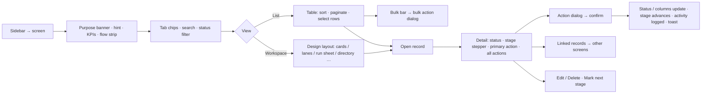
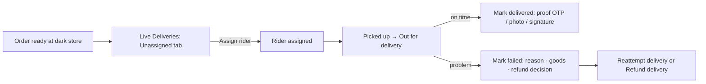
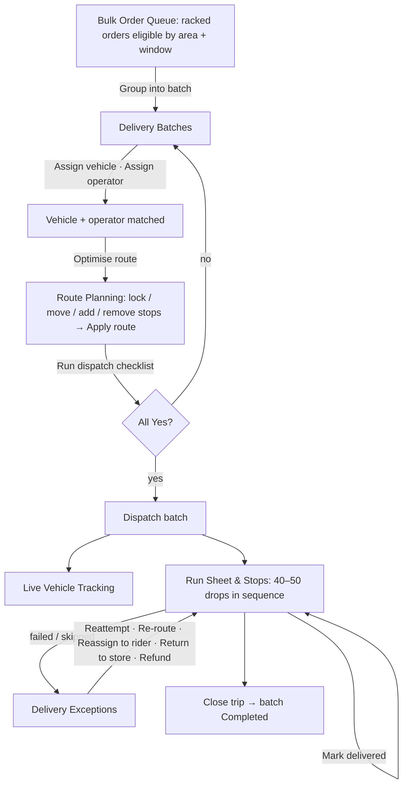
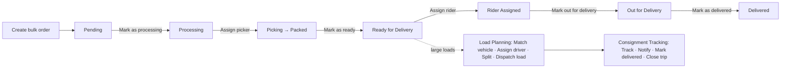
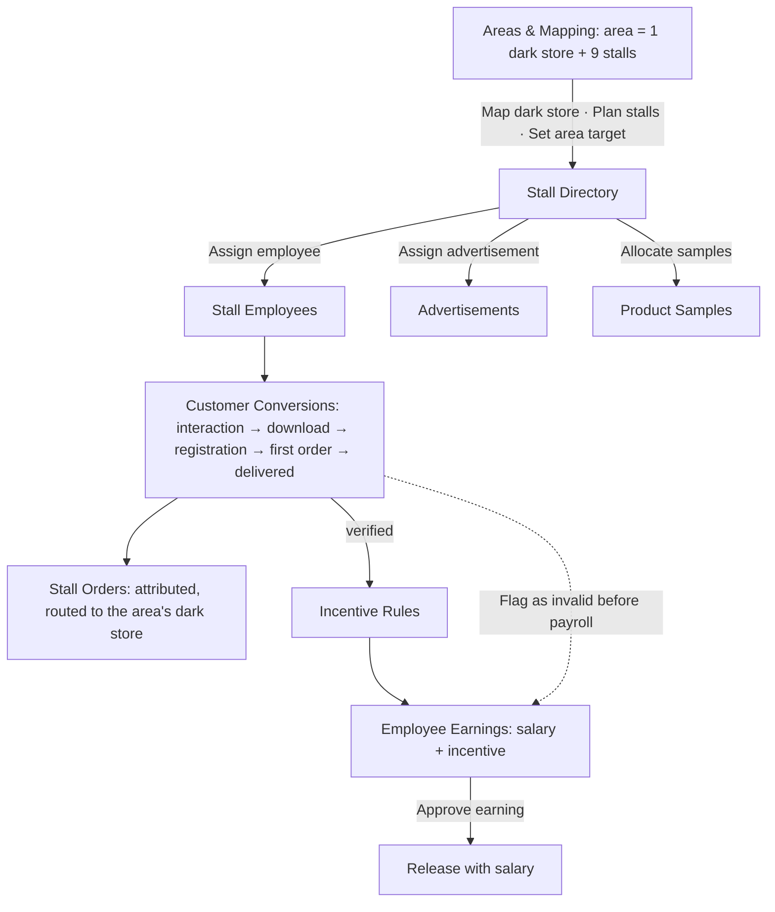

# Delivery & Container Stalls — user flows

How admins use the **Delivery** and **Container Stalls** modules in the Selorg Admin Dashboard: who does
what, in which order, and what each action changes. Screens follow the approved design
(`design-reference/Selorg Admin Dashboard.dc.html`). Endpoints: `docs/DELIVERY_AND_CONTAINER_STALLS_ENDPOINTS.md`.

## Contents

- [Who uses what](#who-uses-what)
- [Common screen pattern](#common-screen-pattern)
- [End-to-end journeys](#end-to-end-journeys)
  - [A. Single delivery](#a-single-delivery-rider)
  - [B. Bulk delivery by e-auto](#b-bulk-delivery-by-e-auto)
  - [C. B2B bulk order](#c-b2b-bulk-order)
  - [D. Container stall network: set up → convert → pay](#d-container-stall-network-set-up--convert--pay)
- [Screen reference — Delivery](#screen-reference--delivery)
- [Screen reference — Container Stalls](#screen-reference--container-stalls)
- [Rules the UI enforces](#rules-the-ui-enforces)

## Who uses what

| Role | Sees | Can act on |
|---|---|---|
| Super Admin, Operations Admin | Both modules | Everything (delete: these two roles only) |
| Rider Manager | Delivery | Every Delivery screen |
| Finance Admin | Container Stalls | Stall Employees (salary), Incentive Rules, Employee Earnings; approves rules and earnings |
| Catalog Manager (design's "Marketing Manager") | Container Stalls | Areas, Stall Directory, Advertisements, Product Samples; approves ads and samples |

Anyone who can see a screen but not act on it gets it read-only: no action buttons, no create/edit/delete.

## Common screen pattern

Every Delivery and Container Stalls screen (except Riders & Live, Zones & Maps and Bulk Orders, which have their own pages) works the same way:

- **URL keeps the view**: `?tab=`, `?q=`, `?status=`; the detail page is `/<screen>/<record id>`, and Back returns to the same filtered list.
- **Primary action**: the action that produces the record's next stage (e.g. an "Awaiting vehicle" batch leads with **Assign vehicle**). Stages owned by another team show "Awaiting …" instead.
- **Mark &lt;next stage&gt;** records a stage that happened outside the dashboard.
- **Export** downloads the current tab/filter as CSV.
- **New / Edit** forms are built from the screen's columns (dropdowns for status, store and area; number checks on counts).

## End-to-end journeys

### A. Single delivery (rider)

1. **Live Deliveries** → *Unassigned* tab lists deliveries needing a rider. Select one (or several in List view) → **Assign rider** (rider, mode: manual / nearest / broadcast).
2. Watch progress in the queue + detail pane (store → picked up → en route → customer). *Running late* collects delays; **Reassign rider** if the rider is stuck.
3. On arrival: **Mark delivered** with proof, or **Mark failed** with reason, what happens to the goods and the refund decision. Follow up with **Reattempt delivery** or **Refund delivery**. **Call customer** is logged but changes nothing.

### B. Bulk delivery by e-auto

1. **Bulk Delivery Board** — morning check: orders ready, batches, vehicles on route, which area is short of a vehicle (*Alerts* tab).
2. **Bulk Order Queue** — only racked orders are eligible. *Suggested batches* shows proposals. **Group into batch** (area, orders, window, vehicle type), **Add to existing batch**, **Mark priority** (can lock the stop first), or **Exclude from bulk** (e.g. fragile → standard rider). *Window at risk* and *Not eligible* tabs show what needs attention.
3. **Delivery Batches** — each batch walks: created → orders assigned → capacity checked → **Assign vehicle** (capacity check) → **Assign operator** (licence) → **Optimise route** → **Run dispatch checklist** (any "No" fails it) → **Dispatch batch** (notify customers, ETA). **Split batch** if over capacity; **Pause / Resume**; **Cancel batch** returns orders to the queue or standard riders.
4. **Route Planning** — *Optimised sequence* vs *Manual order*: **Lock stop** for priority, **Move stop**, **Add stop**, **Remove stop**, **Compare routes**, then **Apply route** to lock the sequence the operator's app follows.
5. **Live Vehicle Tracking** — current stop, next customer, stops left; **Notify customer**, **Call operator**, **Re-route remaining**, **Pause batch** (e.g. puncture), **Close trip** (delivered/failed counts, odometer).
6. **Run Sheet & Stops** — one auto's stops in order with a progress bar. Per stop: **Mark delivered**, **Reattempt stop**, **Skip stop**, **Move to tomorrow**, **Re-queue at end of run**, **Report stop issue**. A failed stop never blocks the other 47.
7. **Delivery Exceptions** — triage lanes (Critical / High / Medium / Resolved); decide per stop and **Resolve exception** with an outcome. **Escalate** to ops lead / finance.
8. **Vehicle Operators** & **Delivery Fleet** keep the supply side ready: assign vehicles and batches, **Renew licence**; fleet **Assign to store / driver**, **Set delivery mode** (cycle, bike, e-auto), **Log maintenance**, **Renew document**, **Mark available**, **Retire vehicle**.

### C. B2B bulk order

1. **Bulk Orders** → **Create bulk order** (client, contact, address, store, delivery date + slot, payment method, product lines).
2. Detail page leads with the next step: **Mark as processing** → **Assign picker** (starts picking) → **Mark as ready** → **Assign rider** → **Mark out for delivery** (blocked without a rider) → **Mark as delivered**. **Update status** also changes payment status; **Cancel order** asks for confirmation.
3. Loads too big for a rider go through **Load Planning** (match vehicle by weight, assign driver, split into trips, dispatch load) and **Consignment Tracking** (track, notify client, mark delivered, close trip).

### D. Container stall network: set up → convert → pay

1. **Network Overview** — daily check: stalls active, interactions, downloads, first orders, conversion by area; *Alerts* (unassigned stalls, exhausted samples, low conversion).
2. **Areas & Mapping** — each area card shows 1 dark-store slot + 9 stall slots. **Map dark store**, **Plan stalls**, **Set area target**, **Review performance**.
3. **Stall Directory** — create stalls; **Assign employee**, **Change status** (planned → setup pending → active → closed / maintenance → inactive), **Close temporarily**, **Deactivate stall** (its employee must be reassigned or they can't earn), **Assign advertisement**, **Allocate samples**, **Edit stall**.
4. **Stall Employees** — **Assign to stall** / **Reassign stall** (one active stall each), **Set fixed salary**, **Mark on leave**, **Review performance**, **Suspend employee**.
5. **Advertisements** — lanes Live / Scheduled / Draft / Ended: **Assign to stalls**, **Schedule campaign**, **Replace creative**, **Extend window**, **End campaign**.
6. **Product Samples** — marketing stock, not sellable: **Allocate samples** → **Approve allocation** → **Record distribution** (distributed ↑, remaining ↓) → **Reconcile allocation**; **Reorder samples** when exhausted.
7. **Customer Conversions** — funnel shows where customers drop out; each conversion is attributed to area, stall and employee. **Reattribute conversion** or **Flag as invalid** (reverses incentive) **before payroll**.
8. **Stall Orders** — attribution only; the order itself follows normal picking and delivery. **Open order** jumps to the Orders workspace.
9. **Incentive Rules** — versioned: **Create new version** → **Submit for approval** → **Approve rule** / **Schedule rule**; **Preview incentive** shows the money before approving; **Expire rule**.
10. **Employee Earnings** — fixed salary + incentive per employee per month: **View calculation**, **Adjust incentive**, **Hold payment**, **Approve earning**, **Release with salary**.

## Screen reference — Delivery

### Live Deliveries — `/deliveries`

**Who / why:** Delivery dispatcher — watch every live delivery and act on the ones running late or without a rider. Assigning notifies the rider app instantly; marking failed decides what happens to the goods and the money.

**Layout:** Dispatch — queue + live detail pane (plus List view) · **Tabs:** Out for delivery · Unassigned · Running late · Arriving now · Completed · Failed · **Record:** Delivery (edit)

**Lifecycle**

1. Order ready _(Store)_
2. Rider assigned _(Auto-assign)_
3. Picked up _(Rider app)_
4. Out for delivery _(Rider app)_
5. Arrived _(Rider app)_
6. Delivered _(OTP verified)_

**Actions**

| Action | Form fields (required *) | Moves the stage |
|---|---|---|
| Assign rider | Rider*, Assignment*, Promise (min), Note | yes |
| Reassign rider | New rider*, Reason*, Note | — |
| Call customer | Purpose*, Note | — |
| Reattempt delivery | Reattempt*, Rider*, Contact customer first*, Note | yes |
| Mark delivered | Proof*, OTP / reference, Note | yes |
| Mark failed | Reason*, Goods*, Refund*, Note* | — |
| Refund delivery | Refund*, Amount (₹)*, Refund to*, Reason* | — |

**Bulk (List view, select rows):** Assign rider (only when every selected status matches) · Reassign rider · Export view

**Linked records:** Rider → `/rider-dir` · Order → `/orders` · Zone → `/zones`

### Bulk Delivery Board — `/bd-overview`

**Who / why:** Delivery operations lead — see whether today's bulk batches are keeping up, and which area is short of vehicles. Every figure drills into the batch, vehicle or exception behind it.

**Layout:** Network cards (area cards, alerts list, funnel bars) (plus List view) · **Tabs:** Board today · By area · Batch funnel · Alerts · **Record:** Area (read-only records, actions only)

**Lifecycle**

_No lifecycle — a summary screen; every card opens the record behind it._

### Bulk Order Queue — `/bd-queue`

**Who / why:** Dispatch coordinator — decide which ready orders travel together on one vehicle. Grouping creates a batch; the order leaves this queue and enters route planning.

**Layout:** Record cards with flow progress (plus List view) · **Tabs:** All eligible · Suggested batches · Unbatched · Window at risk · Not eligible · **Record:** Order (edit)

**Lifecycle**

1. Order packed _(Store)_
2. Racked and ready _(Picker)_
3. Eligible for bulk _(System)_
4. Selected into batch _(Dispatch)_
5. Route planned _(Dispatch)_
6. Dispatched _(Operator)_

**Actions**

| Action | Form fields (required *) | Moves the stage |
|---|---|---|
| Group into batch | Area*, Orders to include*, Delivery window*, Vehicle class needed*, Note | yes |
| Add to existing batch | Batch*, Impact*, Note | yes |
| Remove from batch | Reason*, Route*, Note* | — |
| Mark priority | Priority*, Reason*, Lock its position in the route*, Note | yes |
| Exclude from bulk | Reason*, Deliver instead by*, Note* | — |

**Bulk (List view, select rows):** Group into batch · Mark priority · Export view

**Linked records:** Order → `/orders` · Suggested batch → `/bd-batches` · Area → `/zones`

### Delivery Batches — `/bd-batches`

**Who / why:** Dispatch coordinator — get each batch a vehicle, an operator and a confirmed route before it leaves. Dispatch is blocked until capacity, route and operator are all in place.

**Layout:** Record cards with flow progress (plus List view) · **Tabs:** All batches · Awaiting dispatch · In transit · Completed · Over capacity · Cancelled · **Record:** Batch (create / edit)

**Lifecycle**

1. Batch created _(Dispatch)_
2. Orders assigned _(Dispatch)_
3. Capacity checked _(System)_
4. Vehicle assigned _(Dispatch)_
5. Route optimised _(Route engine)_
6. Ready for dispatch _(Dispatch)_
7. Dispatched _(Operator)_
8. Partially delivered _(Operator)_
9. Completed _(System)_

**Actions**

| Action | Form fields (required *) | Moves the stage |
|---|---|---|
| Assign vehicle | Vehicle*, Estimated load (kg)*, Capacity*, Note | yes |
| Assign operator | Operator*, Licence class*, Reporting time*, Note | yes |
| Optimise route | Optimise for*, Respect locked stops*, Start from*, Note | yes |
| Run dispatch checklist | All orders racked and ready*, Vehicle available and within capacity*, Operator assigned and reported*, Route optimised and applied*, No blocking exceptions*, Note | yes |
| Dispatch batch | Departure time*, Last stop ETA*, Notify customers*, With the operator*, Note | yes |
| Pause batch | Reason*, Expected resume*, Notify remaining customers*, Note* | — |
| Resume batch | Resume at*, Revised last-stop ETA*, Note | yes |
| Split batch | Split into*, Split by*, Second vehicle*, Note | yes |
| Cancel batch | Reason*, The orders*, Note* | — |

**Bulk (List view, select rows):** Assign vehicle · Optimise route · Dispatch batch · Cancel batch

**Linked records:** Run sheet → `/bd-stops` · Route → `/bd-route` · Vehicle → `/vehicles`

### Load Planning — `/bulk-dispatch`

**Who / why:** Dispatch coordinator — match each B2B load to a vehicle and driver that can carry it. Dispatching a load hands it to Consignment Tracking until the client confirms delivery.

**Layout:** Record cards with flow progress (plus List view) · **Tabs:** Today's loads · Assigned · Completed · **Record:** Load plan (create / edit)

**Lifecycle**

1. Load planned
2. Vehicle matched
3. Driver assigned
4. Loading
5. Dispatched
6. Delivered

**Actions**

| Action | Form fields (required *) | Moves the stage |
|---|---|---|
| Match vehicle | Vehicle*, Load weight (kg)*, Capacity check*, Note | yes |
| Assign driver | Rider / operator*, Delivery mode*, Licence verified*, Reporting time*, Note | yes |
| Split into trips | Number of trips*, Split by*, Second trip vehicle*, Note | yes |
| Dispatch load | Departure time*, ETA at site*, Notify customer*, Note | yes |

**Bulk (List view, select rows):** Match vehicle · Dispatch load · Export view

### Run Sheet & Stops — `/bd-stops`

**Who / why:** Dispatch and support — follow one auto's run stop by stop and see the outcome of each individual customer drop. A failed stop is re-queued onto the end of the run or moved to tomorrow — the other 47 deliveries continue unaffected.

**Layout:** Run sheet — stop rail with per-stop actions (plus List view) · **Tabs:** Run sheet · Delivered · Failed & skipped · Pending · Re-queued · **Record:** Stop (edit)

**Lifecycle**

1. Manifest built _(Dispatch)_
2. Loaded onto auto _(Store)_
3. Run started _(Operator)_
4. Delivering in sequence _(Operator)_
5. Failed stops re-queued _(Dispatch)_
6. Run closed _(System)_

**Actions**

| Action | Form fields (required *) | Moves the stage |
|---|---|---|
| Mark delivered | Proof*, OTP / reference, Note | yes |
| Reattempt stop | Reattempt*, Contact customer first*, Note | yes |
| Skip stop | Stop*, Reason*, The order*, Note* | — |
| Call customer | Purpose*, Note | — |
| Move to tomorrow | Tomorrow's slot*, Goods overnight*, Reason*, Note* | yes |
| Re-queue at end of run | Insert as*, Revised ETA, Note | yes |
| Report stop issue | Issue*, Bag, Action*, Details* | — |

**Bulk (List view, select rows):** Reattempt stop · Export view · Skip stop

**Linked records:** Order → `/orders` · Batch → `/bd-batches` · Live position → `/bd-track`

### Route Planning — `/bd-route`

**Who / why:** Dispatch coordinator — sequence the stops so every delivery window is met with the least distance. Applying a route locks the sequence the operator's app will follow.

**Layout:** Route plan — numbered stop sequence with lock/move/remove (plus List view) · **Tabs:** Optimised sequence · Manual order · Route comparison · Constraints · **Record:** Route (edit)

**Lifecycle**

1. Stops loaded _(System)_
2. Constraints applied _(Dispatch)_
3. Route optimised _(Route engine)_
4. Reviewed _(Dispatch)_
5. Applied _(Dispatch)_
6. Locked for dispatch _(System)_

**Actions**

| Action | Form fields (required *) | Moves the stage |
|---|---|---|
| Optimise route | Optimise for*, Respect locked stops*, Start from*, Note | yes |
| Lock stop | Stop*, Reason*, Note | yes |
| Unlock stop | Stop*, Then*, Note | yes |
| Move stop | Move stop*, To position*, Reason*, After moving*, Note | yes |
| Add stop | Order*, Insert at*, Impact*, Note | yes |
| Remove stop | Stop*, The order then*, Reason* | — |
| Compare routes | Compare optimised against* | — |
| Apply route | Apply*, Lock for dispatch*, Note | yes |

**Linked records:** Batch → `/bd-batches` · Order → `/orders` · Tracking → `/bd-track`

### Live Vehicle Tracking — `/bd-track`

**Who / why:** Dispatch and support — know where each vehicle is, which stop it is on and who is next. Skipping a stop or re-routing changes the operator's app immediately.

**Layout:** Dispatch — queue + live detail pane (plus List view) · **Tabs:** On route · Running late · At a stop · Paused · Returned · **Record:** Vehicle (read-only records, actions only)

**Lifecycle**

1. Dispatched _(Operator)_
2. Left the store _(Operator)_
3. Between stops _(Vehicle)_
4. At a stop _(Operator)_
5. Stop delivered _(Operator)_
6. Returning _(Operator)_
7. Trip closed _(System)_

**Actions**

| Action | Form fields (required *) | Moves the stage |
|---|---|---|
| Track live | Show* | — |
| Call operator | Purpose*, Note | — |
| Notify customer | Channel*, Message*, Note | — |
| Skip stop | Stop*, Reason*, The order*, Note* | — |
| Re-route remaining | Re-optimise for*, Include skipped stops*, Note | yes |
| Pause batch | Reason*, Expected resume*, Notify remaining customers*, Note* | — |
| Close trip | Stops delivered*, Stops failed, Actual distance (km), Vehicle returned*, Note | yes |

**Bulk (List view, select rows):** Notify customer · Export view · Pause batch

**Linked records:** Batch → `/bd-batches` · Operator → `/bd-ops` · Exceptions → `/bd-exceptions`

### Consignment Tracking — `/bulk-track`

**Who / why:** Dispatch and account managers — know where every B2B consignment is and warn the client before it runs late. A delayed consignment is flagged to the client; delivery confirmation closes it.

**Layout:** Dispatch — queue + live detail pane (plus List view) · **Tabs:** Active · In transit · Delivered · Exceptions · **Record:** Consignment (edit)

**Lifecycle**

1. Scheduled
2. Loading
3. In transit
4. Out for delivery
5. Delivered
6. Confirmed by client

**Actions**

| Action | Form fields (required *) | Moves the stage |
|---|---|---|
| Track live | Show* | — |
| Call operator | Purpose*, Note | — |
| Notify customer | Channel*, Message*, Note | — |
| Mark delivered | Proof*, OTP / reference, Note | yes |
| Close trip | Stops delivered*, Stops failed, Actual distance (km), Vehicle returned*, Note | yes |

**Bulk (List view, select rows):** Notify customer · Export view

### Vehicle Operators — `/bd-ops`

**Who / why:** Fleet operations — keep bulk operators licensed, paired with a vehicle and assigned to batches. An operator with an expired licence cannot be assigned to a batch.

**Layout:** Directory — list + profile pane (plus List view) · **Tabs:** All operators · On route · Available · Off duty · Licence check · **Record:** Operator (create / edit)

**Lifecycle**

1. Onboarded _(Fleet ops)_
2. Licence verified _(Compliance)_
3. Vehicle assigned _(Dispatch)_
4. Batch assigned _(Dispatch)_
5. On route _(System)_
6. Off duty _(System)_

**Actions**

| Action | Form fields (required *) | Moves the stage |
|---|---|---|
| Assign vehicle | Vehicle*, Estimated load (kg)*, Capacity*, Note | yes |
| Assign batch | Batch*, Vehicle*, Note | yes |
| Renew licence | Licence class*, New expiry*, Licence number, Note | yes |
| Mark off duty | Reason*, Back on, Note | yes |
| Review performance | Period*, Verdict*, Note* | yes |

**Linked records:** Vehicle → `/vehicles` · Batches → `/bd-batches` · Tracking → `/bd-track`

### Delivery Exceptions — `/bd-exceptions`

**Who / why:** Dispatch and support — decide what happens to one failed stop while the rest of the route continues. Reattempting reinserts the stop; returning to store releases the vehicle to finish the batch.

**Layout:** Triage lanes by severity (plus List view) · **Tabs:** Open · Customer issues · Vehicle & route · Resolved today · **Record:** Exception (edit)

**Lifecycle**

1. Raised at the stop _(Operator)_
2. Triaged _(Dispatch)_
3. Decision made _(Dispatch)_
4. Action taken _(Operator or support)_
5. Resolved _(Dispatch)_
6. Audited _(System)_

**Actions**

| Action | Form fields (required *) | Moves the stage |
|---|---|---|
| Reattempt stop | Reattempt*, Contact customer first*, Note | yes |
| Skip stop | Stop*, Reason*, The order*, Note* | — |
| Re-route remaining | Re-optimise for*, Include skipped stops*, Note | yes |
| Reassign to rider | Rider*, Pick up from*, Note | yes |
| Return to store | Goods condition*, Customer*, Note* | yes |
| Refund order | Refund*, Amount (₹)*, Refund to*, Reason* | — |
| Escalate | Escalate to*, Severity*, Reason* | — |
| Resolve exception | Outcome*, Remaining route*, Resolution note* | yes |

**Bulk (List view, select rows):** Reattempt stop · Skip stop · Resolve exception

**Linked records:** Batch → `/bd-batches` · Order → `/orders` · Operator → `/bd-ops`

### Delivery Fleet — `/vehicles`

**Who / why:** Fleet operations — keep every vehicle charged, road-legal and matched to a rider — cycles and bikes for single deliveries, e-autos for 40–50 order bulk batches. Mode decides the work: a cycle or bike takes one order at a time, an e-auto takes a whole batch. A vehicle charging, in service or out of documents can be assigned neither.

**Layout:** Site cards with utilisation (plus List view) · **Tabs:** All vehicles · E-auto · bulk · Bike · single · Cycle · single · Charging & service · Documents · **Record:** Vehicle (create / edit / delete)

**Lifecycle**

1. Vehicle onboarded _(Fleet ops)_
2. Documents verified _(Compliance)_
3. Assigned to store _(Fleet ops)_
4. Driver assigned _(Dispatch)_
5. In service _(System)_
6. Maintenance _(Fleet ops)_
7. Retired _(Fleet ops)_

**Actions**

| Action | Form fields (required *) | Moves the stage |
|---|---|---|
| Assign to store | Dark store*, Shift*, Note | yes |
| Assign driver | Rider / operator*, Delivery mode*, Licence verified*, Reporting time*, Note | yes |
| Set delivery mode | Mode*, Serves within*, Effective*, Note | yes |
| Log maintenance | Work*, Off road from*, Expected days*, Estimated cost (₹), Note | yes |
| Renew document | Document*, New expiry*, Reference number, Note | yes |
| Mark available | Confirmed*, Return to store*, Note | yes |
| Retire vehicle | Reason*, Effective*, Note* | — |

**Bulk (List view, select rows):** Assign to store · Log maintenance · Export view

**Linked records:** Home dark store → `/stores` · Batches → `/bd-batches` · Operator → `/bd-ops`

### Bulk Orders — `/bulk-orders`

B2B orders page (see journey C): filters for order ID, customer/business, delivery status, payment status and order-date range; KPI cards per status; table with sorting and pagination; detail with order info, items, payment breakdown (subtotal, discount, delivery, GST, total), delivery (picker, rider, slot) and timeline.

### Riders & Live — `/riders` · Zones & Maps — `/zones`

Unchanged; both run on the live backend.

## Screen reference — Container Stalls

### Network Overview — `/stall-overview`

**Who / why:** Marketing and operations leads — see whether the stall network is bringing customers onto the app, and where it is not. Every figure here is attributed to an area, stall and employee — open any row to drill in.

**Layout:** Network cards (area cards, alerts list, funnel bars) (plus List view) · **Tabs:** Network today · By area · Funnel · Alerts · **Record:** Area (read-only records, actions only)

**Lifecycle**

_No lifecycle — a summary screen; every card opens the record behind it._

### Areas & Mapping — `/stall-areas`

**Who / why:** Operations lead — keep each area at its full 10 stores — 1 main dark store holding the stock, 9 container stores converting customers. Container stores carry no sellable stock; every order they generate is fulfilled by the area's main dark store.

**Layout:** Network cards (area cards, alerts list, funnel bars) (plus List view) · **Tabs:** All areas · Complete (10 of 10) · Gaps · Under review · **Record:** Area (create / edit / delete)

**Lifecycle**

1. Area defined _(Ops)_
2. Main dark store mapped _(Ops)_
3. 9 container stores planned _(Marketing)_
4. Container stores set up _(Field ops)_
5. Area of 10 live _(System)_
6. Under review _(Marketing)_

**Actions**

| Action | Form fields (required *) | Moves the stage |
|---|---|---|
| Map dark store | Dark store*, Distance from area centre*, Note | yes |
| Plan stalls | Stalls to plan*, Target live date*, Field owner*, Note | yes |
| Set area target | Target on*, Target value*, Review*, Note | yes |
| Review performance | Period*, Verdict*, Note* | yes |

**Linked records:** Dark store → `/stores` · Stalls in area → `/stalls` · Employees → `/stall-staff`

### Stall Directory — `/stalls`

**Who / why:** Field operations — know which stalls are standing, staffed and converting, and which need attention. Deactivating a stall stops attribution; its employee must be reassigned or they cannot earn incentive.

**Layout:** Site cards with utilisation (plus List view) · **Tabs:** All stalls · Active · Setup pending · Closed & maintenance · Unassigned · Top performing · **Record:** Container stall (create / edit / delete)

**Lifecycle**

1. Planned _(Marketing)_
2. Setup pending _(Field ops)_
3. Employee assigned _(Field ops)_
4. Active _(System)_
5. Temporarily closed _(Field ops)_
6. Maintenance _(Field ops)_
7. Inactive _(Marketing)_

**Actions**

| Action | Form fields (required *) | Moves the stage |
|---|---|---|
| Assign employee | Employee*, Effective from*, Stall hours*, Note | yes |
| Change status | New status*, Reason*, Reopen on, Note* | yes |
| Assign advertisement | Advertisement*, Live from*, Until, Note | yes |
| Allocate samples | Product*, Quantity*, Distribute from*, Until, Note | yes |
| Edit stall | Stall name*, Address*, Operating hours*, Operating days*, Reason for change* | yes |
| Close temporarily | Reason*, Reopen on*, Note* | — |
| Deactivate stall | Reason*, Assigned employee*, Note* | — |

**Bulk (List view, select rows):** Assign advertisement · Allocate samples · Export view · Change status

**Linked records:** Area → `/stall-areas` · Employee → `/stall-staff` · Conversions → `/stall-conv`

### Stall Employees — `/stall-staff`

**Who / why:** Field ops and HR — manage the field employees who convert walk-up customers into app users. An employee can hold one active stall assignment; reassigning ends the previous one on its effective date.

**Layout:** Directory — list + profile pane (plus List view) · **Tabs:** All employees · Active · Unassigned · On leave · Top converters · **Record:** Stall employee (create / edit / delete)

**Lifecycle**

1. Hired _(HR)_
2. Documents verified _(Compliance)_
3. Area assigned _(Field ops)_
4. Stall assigned _(Field ops)_
5. Active _(System)_
6. On leave _(HR)_
7. Exited _(HR)_

**Actions**

| Action | Form fields (required *) | Moves the stage |
|---|---|---|
| Assign to stall | Area*, Stall*, Effective from*, Note | yes |
| Reassign stall | New stall*, Effective from*, Reason*, Note* | yes |
| Set fixed salary | Monthly fixed salary (₹)*, Effective from*, Reason*, Note* | yes |
| Mark on leave | Leave type*, From*, To*, Stall cover*, Note | yes |
| Review performance | Period*, Verdict*, Note* | yes |
| Suspend employee | Reason*, Suspend for*, Pay during suspension*, Note* | — |

**Bulk (List view, select rows):** Assign to stall · Set fixed salary · Export view

**Linked records:** Stall → `/stalls` · Conversions → `/stall-conv` · Earnings → `/stall-earnings`

### Customer Conversions — `/stall-conv`

**Who / why:** Marketing analyst — see exactly where customers drop out between meeting a stall and their first order. Verified first orders are what trigger employee incentive — invalid conversions must be flagged before payroll.

**Layout:** Funnel bars + conversion cards (plus List view) · **Tabs:** Today's conversions · Completed · Dropped after download · Registered, no order · Order failed · **Record:** Conversion (read-only records, actions only)

**Lifecycle**

1. Customer interaction _(Stall employee)_
2. App downloaded _(Customer)_
3. Registered _(Customer)_
4. First order placed _(Customer)_
5. Order delivered _(Rider)_
6. Conversion counted _(System)_
7. Incentive accrued _(Finance)_

**Actions**

| Action | Form fields (required *) | Moves the stage |
|---|---|---|
| View attribution | Show* | — |
| Open customer | Open* | — |
| Reattribute conversion | Attribute to*, Stall*, Reason*, Justification* | — |
| Flag as invalid | Reason*, Incentive*, Evidence* | — |

**Bulk (List view, select rows):** Export view · Flag as invalid

**Linked records:** Stall → `/stalls` · Employee → `/stall-staff` · Order → `/stall-orders`

### Stall Orders — `/stall-orders`

**Who / why:** Operations and finance — confirm which orders exist because of a stall, and that each went to the right dark store. This is attribution only — the order itself follows the normal picking, bagging and delivery flow.

**Layout:** Record cards with flow progress (plus List view) · **Tabs:** All stall orders · First orders · Repeat orders · Delivered · Failed · **Record:** Stall order (read-only records, actions only)

**Lifecycle**

1. Placed via stall conversion _(Customer app)_
2. Attributed to stall _(System)_
3. Routed to mapped dark store _(System)_
4. Picked and packed _(Store)_
5. Out for delivery _(Rider)_
6. Delivered _(Rider)_
7. Counted to stall _(System)_

**Actions**

| Action | Form fields (required *) | Moves the stage |
|---|---|---|
| Open order | Open* | — |
| View attribution | Show* | — |
| Reattribute conversion | Attribute to*, Stall*, Reason*, Justification* | — |

**Bulk (List view, select rows):** Export view

**Linked records:** Order → `/orders` · Stall → `/stalls` · Dark store → `/stores`

### Advertisements — `/stall-ads`

**Who / why:** Marketing manager — decide what advertising is standing at which stalls, and for how long. Assigning to an area pushes the creative to every active stall in it at the scheduled start.

**Layout:** Campaign lanes (Live / Scheduled / Draft / Ended) (plus List view) · **Tabs:** All campaigns · Running · Scheduled · Draft · Ended · **Record:** Advertisement (create / edit / delete)

**Lifecycle**

1. Draft _(Marketing)_
2. Creative approved _(Marketing Manager)_
3. Stalls selected _(Marketing)_
4. Scheduled _(Marketing)_
5. Running _(System)_
6. Ended _(System)_
7. Analysed _(Marketing)_

**Actions**

| Action | Form fields (required *) | Moves the stage |
|---|---|---|
| Assign to stalls | Assign to*, Area, Live from*, Note | yes |
| Schedule campaign | Starts*, Ends*, Stalls covered*, Budget (₹), Note | yes |
| Replace creative | New creative*, Material*, Note | yes |
| Extend window | Extend until*, Additional budget (₹), Note | yes |
| End campaign | End*, Reason*, Note* | — |

**Bulk (List view, select rows):** Assign to stalls · Schedule campaign · End campaign

**Linked records:** Stalls covered → `/stalls` · Conversions → `/stall-conv` · Media → `/cms-media`

### Product Samples — `/stall-samples`

**Who / why:** Field ops and marketing — allocate tasting samples to stalls and see what has actually been handed out. Samples are marketing stock, not saleable inventory — exhausted allocations stop the sampling drive.

**Layout:** Record cards with flow progress (plus List view) · **Tabs:** Active allocations · Exhausted · Awaiting approval · Reconciled · **Record:** Sample allocation (create / edit)

**Lifecycle**

1. Requested _(Field ops)_
2. Approved _(Marketing Manager)_
3. Allocated to stall _(Marketing)_
4. Distributing _(Stall employee)_
5. Reconciled _(Field ops)_
6. Closed _(Marketing)_

**Actions**

| Action | Form fields (required *) | Moves the stage |
|---|---|---|
| Approve allocation | Approved quantity*, Source*, Note | yes |
| Allocate samples | Product*, Quantity*, Distribute from*, Until, Note | yes |
| Record distribution | Units distributed*, Date*, Customer interactions, Note | yes |
| Reconcile allocation | Distributed*, Returned unused, Wastage / spoilage, Note* | yes |
| Reorder samples | Quantity*, Priority*, Note | yes |

**Bulk (List view, select rows):** Approve allocation · Reorder samples · Export view

**Linked records:** Stall → `/stalls` · Employee → `/stall-staff` · Product → `/catalog`

### Incentive Rules — `/stall-incentives`

**Who / why:** Finance admin — set what a stall employee earns per registration and per verified first order. Editing an active rule creates a new version; the current one keeps paying until the new one is approved.

**Layout:** Rule cards (plus List view) · **Tabs:** Active rules · Conversion rules · Volume rules · Scheduled · Version history · **Record:** Incentive rule (create / edit)

**Lifecycle**

1. Draft _(Finance)_
2. Metric & threshold set _(Finance)_
3. Previewed _(Finance)_
4. Approved _(Finance Admin)_
5. Active _(System)_
6. Expired _(System)_

**Actions**

| Action | Form fields (required *) | Moves the stage |
|---|---|---|
| Preview incentive | Interactions*, Registrations*, First orders*, Eligible order value (₹), Area* | — |
| Create new version | What changes*, New value*, Effective from*, Reason for change* | yes |
| Submit for approval | Approver*, Requested effective date*, Note | yes |
| Approve rule | Approving*, Effective from*, Note | yes |
| Schedule rule | Starts*, Ends, Scope*, Note | yes |
| Expire rule | Expire*, Replaced by*, Note* | — |

**Linked records:** Earnings → `/stall-earnings` · Employees → `/stall-staff` · Audit → `/audit`

### Employee Earnings — `/stall-earnings`

**Who / why:** Finance — check fixed salary and earned incentive separately before the monthly payroll. Approving releases the total with the month's salary run; incentive is never paid on unverified conversions.

**Layout:** Earning cards (plus List view) · **Tabs:** August payable · Incentive detail · Approved · On hold · Paid history · **Record:** Earning (edit)

**Lifecycle**

1. Conversions verified _(System)_
2. Incentive calculated _(Rules engine)_
3. Month closed _(System)_
4. Reviewed _(Finance)_
5. Approved _(Finance Admin)_
6. Paid with salary _(Finance)_
7. Payslip issued _(System)_

**Actions**

| Action | Form fields (required *) | Moves the stage |
|---|---|---|
| View calculation | Show* | — |
| Approve earning | Period*, Confirmed*, Note | yes |
| Adjust incentive | Adjustment*, Amount (₹)*, Reason*, Justification* | yes |
| Hold payment | Hold*, Reason*, Review on, Note* | — |
| Release with salary | Salary month*, Pay date*, Method*, Note | yes |

**Bulk (List view, select rows):** Approve earning · Export view · Hold payment

**Linked records:** Employee → `/stall-staff` · Rules applied → `/stall-incentives` · Conversions → `/stall-conv`

## Rules the UI enforces

- **Required fields** in action forms are marked `*`; the dialog won't submit until they're filled.
- **Reason required** for disruptive actions without a form (cancel, escalate, pause, end, flag).
- **Closed records don't move**: a status-changing action on a Completed / Delivered / Cancelled / Retired / Expired / Ended / Trip closed / Resolved / Paid / Inactive / Reconciled / Refunded record is refused with the reason ("Nothing was changed"). After-the-fact actions stay available: refunds, flag or reattribute a conversion, report a stop issue, review performance, change status, create a new rule version, mark a vehicle available.
- **Bulk with mixed statuses** only offers actions valid for every selected record (e.g. *Assign rider* only when all selected deliveries need a rider).
- **Bulk orders move forward only**; *Out for Delivery* needs a rider; delivered orders can't be cancelled.
- **Delete** exists only where the design allows it (areas, stalls, employees, ads, vehicles) and only for Super Admin / Operations Admin, behind a confirmation.
- **Every change is logged** on the record's Activity panel with who, when and the form summary.

> Frontend data is local (seeded from the design, saved in the browser) until the endpoints in
> `docs/DELIVERY_AND_CONTAINER_STALLS_ENDPOINTS.md` exist.
